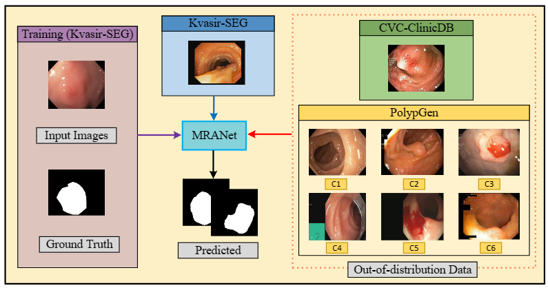
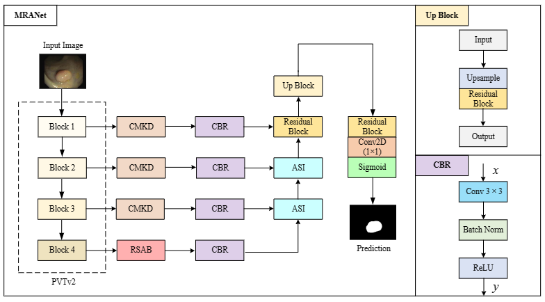
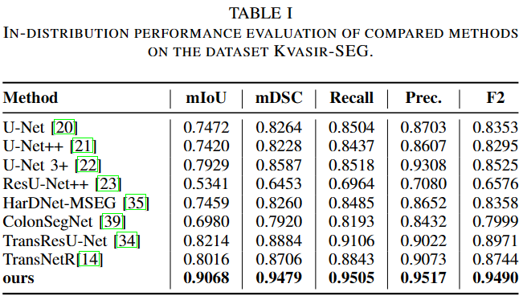
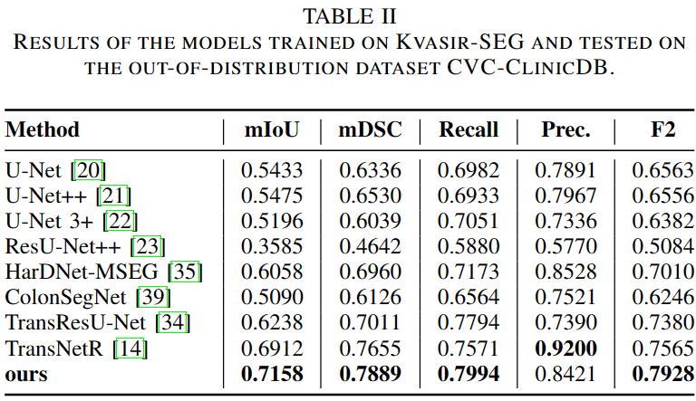
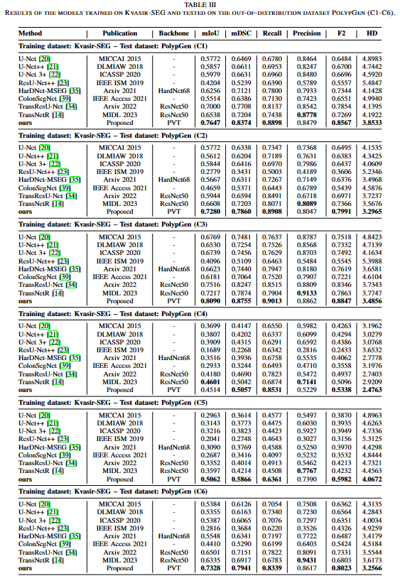
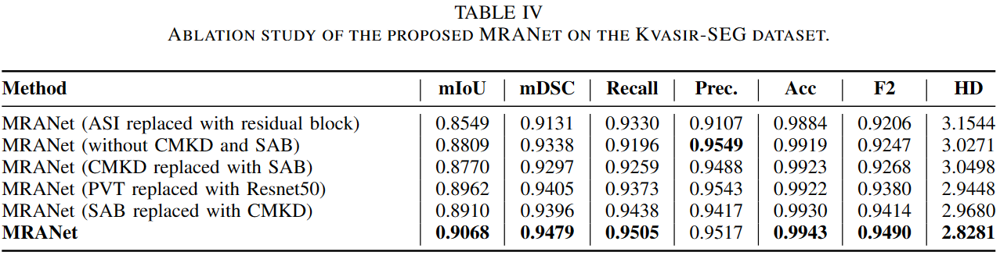
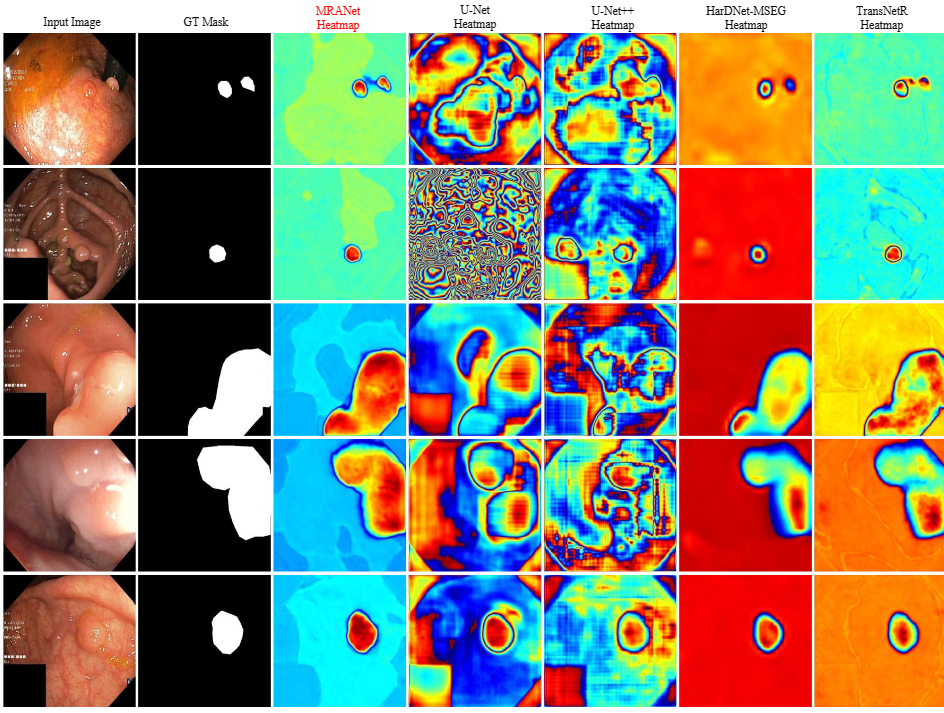
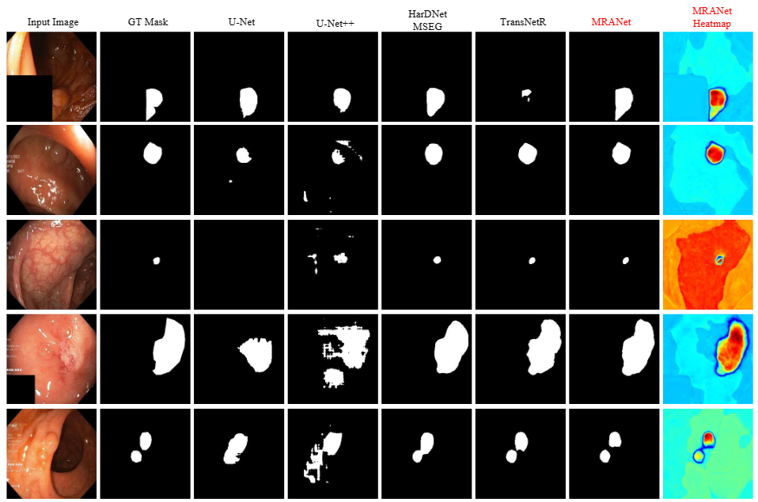
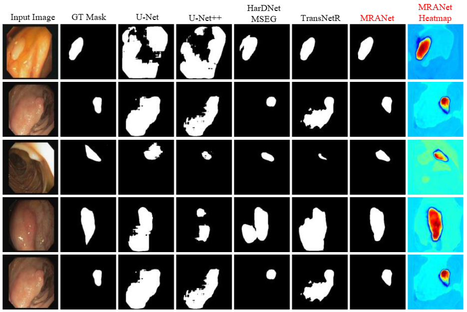

# MRANet: Multi-dimensional Residual Attentional Network for Precise Polyp Segmentation

MRANetis an encoder decoder network which can be used for efficient biomedical image segmentation for both in-distribution and out-of-distribution datasets.

## In-distribution and Out-of-distributuion dataset

*Fig. 1. The work has undergone both internal and external validation, and the model has been comprehensively trained on the Kvasir-SEG dataset. Through testing on the Kvasir-SEG, CVC-ClinicDB, and PolypGen datasets, the model's generalization ability in different real-world scenarios has been verified. In the PolypGen dataset, C1 to C6 represent data from different centers.*

## MRANet

*Fig. 2. Overview of the MRANet framework. This figure illustrates a deep learning model architecture containing multiple functional modules that perform feature extraction and processing of an input polyp image through a series of operations such as convolution, normalization, activation, and attentional mechanisms, ultimately outputting a prediction.*

## datasets

download the datasets (1) [kvasir-seg](https://pan.baidu.com/s/1gz9vq84TUTveCXxoLNmzfg?pwd=u63y), (2) [CVC-ClinicDB](https://pan.baidu.com/s/1y_r5J79_X9E7wdVj5pOwYw?pwd=mmu3) and (3) [PolypGen](https://pan.baidu.com/s/1g7I-1BKFgekLPAnMSPDxew?pwd=wofx).

## trained model

We provide pth of our MRANet trained on kvasir-seg: [MRANet.pth](https://pan.baidu.com/s/1ynLgefxfBpH_fGo5LcC3kA?pwd=rkvw)

## results (Qualitative results)

## results (Qualitative results)

*Fig. 7. The heatmap display the intensity of the regions of interest predicted by each model.*

---

*Fig. 8. Qualitative example showing polyp segmentation on Kvasir-SEG.*

---

*Fig. 9. Qualitative example showing polyp segmentation on CVC-ClinicDB.*
