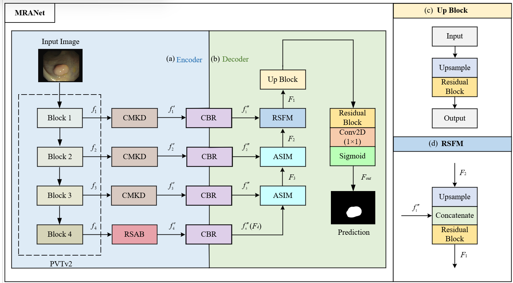

# MRANet

An encoder-decoder network which can be used for efficient biomedical image segmentation.

## 

## datasets

download the datasets (1) [kvasir-seg](https://pan.baidu.com/s/1gz9vq84TUTveCXxoLNmzfg?pwd=u63y), (2) [CVC-ClinicDB](https://pan.baidu.com/s/1y_r5J79_X9E7wdVj5pOwYw?pwd=mmu3) and (3) [PolypGen](https://pan.baidu.com/s/1g7I-1BKFgekLPAnMSPDxew?pwd=wofx).

## trained model

We provide pth of our MRANet trained on kvasir-seg: [MRANet.pth](https://pan.baidu.com/s/1ynLgefxfBpH_fGo5LcC3kA?pwd=rkvw)
